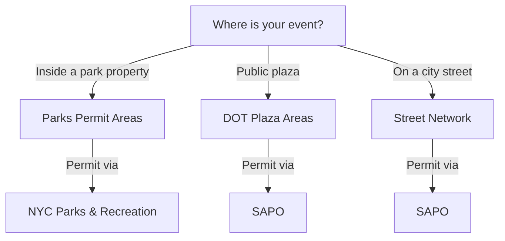

Space Stager supports three geometry modes. Pick the one that matches where your event will take place.

## Parks Permit Areas (Polygons)

- Use when your event is inside a NYC Parks–managed space.
- Search by park name/property; focus is scoped to the selected park polygon.
- Permit authority: NYC Parks & Recreation.

Choose this if: the venue is a park property (e.g., Prospect Park, Central Park).

## DOT Plaza Areas (Polygons)

- Use for public plazas managed by NYC DOT.
- Search by frontage street names; focus is scoped to the plaza polygon.
- Permit authority: SAPO (Street Activity Permit Office).

Choose this if: the venue is a designated public plaza (e.g., Times Sq pedestrian plaza segments).

## Street Network (Intersections / Blocks)

- Use for events on public streets (block-by-block).
- Search by cross streets; focus uses intersection/segment points to define working extents.
- Permit authority: SAPO.

Choose this if: the venue is a city street segment (block party, open street, curbside activation).

